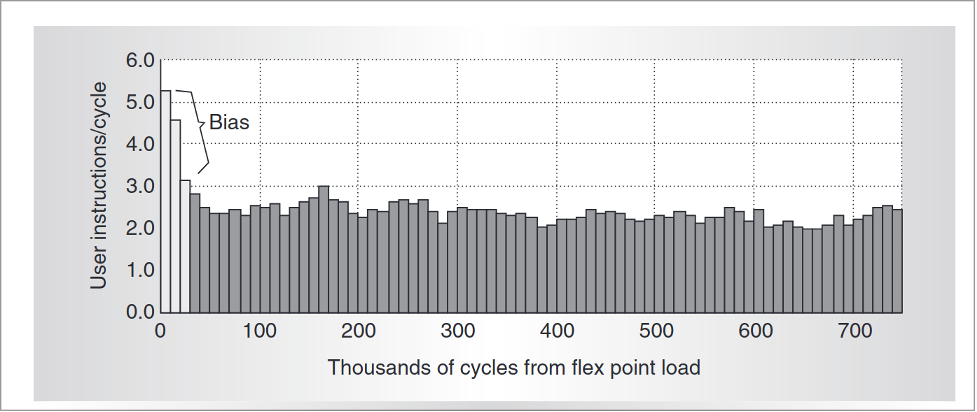
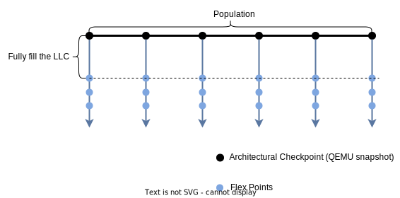

# Sampled Simulation for Server Workloads

## Terminology
- Population: The set of workload executions studied within a research context, from which samples are drawn. The population can be defined as the entire program instruction stream for single-threaded workloads (as in SMARTS [1]), and executions of a multithreaded application (as in SimFlex [2]).
- Sample: A subset of the population that is measured or analyzed.
- Sampling Unit: The smallest continuous subset of the population that is measured of the performance metric.
- Sampling Interval: The distance between two consecutive sampling units measured.
- Error: The difference between an estimated value derived from the sample and the actual value derived from the population. Error can be categorized as:
- Sampling Error: Arises from differences between the sample and the population. This error can be statistically bounded with a confidence level and based on population distribution.
- Non-Sampling Error: Caused by factors other than sampling. One example is bias, which can occur due to specific system or algorithm properties, such as improper warming.
- Confidence Level: A statistical measure indicating the degree of certainty associated with an estimate. Often combined with hypothesis testing to determine if the sample size is adequate to bound the sampling error.
- Architectural Checkpoint: A snapshot of the architectural state, including register files, memory, and device states. A QEMU snapshot is one example of an architectural checkpoint.
- Microarchitectural Checkpoint: A snapshot of the microarchitectural components' states, such as cache tables, TLBs, directories, and branch predictors.
- Flex Points: A checkpoint format used by SimFlex that includes both architectural and microarchitectural states.
- Epoch: A complete functional warming workflow, starting from an architectural checkpoint, and generating flex points before the cache hierarchy is fully warmed.
- Target: The machine being simulated.
- Host: The machine running the simulation.

## What is Unique about Server Workloads?
- Server workload methodologies generally require measurements over multiple seconds of wall clock time on the target machine.
- Server workload metrics are often too coarse-grained for measurement during simulation.
- Full-system simulation is necessary due to deep software stacks.
- Tuning server stacks to achieve desired loads is particularly challenging.

## Server Workloads Taxonomy
- Dimension 1: Online Services vs. Analytics
    - Online Services: Requests between server and client, with throughput measured under a specific tail latency constraint, i.e., the Service-Level Objective (SLO). 
    - Analytics: Perform data processing (e.g., page rank, data cleaning, ML training) on large datasets. Metrics include throughput or the time required to complete processing.
- Dimension 2: Single-Component Workload vs. Multi-Component Workload
    - Single-Component Workload: Consists of a single measurable component, such as a monolithic server application (e.g., database, caching layer, web server, or analytics algorithm).
    - Multi-Component Workload: Includes multiple components, such as microservices (where each container is a component), serverless functions (where each lambda function is a component), or consolidated monoliths to optimize server resource utilization.

## Server Simulation Methodology Taxonomy
- Dimension 1: Instruction-Based Sampling vs. Time-Based Sampling
    - Instruction-Based Sampling: Uses instruction count as the progress metric, with all cores executing the same number of instructions when a checkpoint is taken.
    - Time-Based Sampling: Uses target cycles as the progress metric, with all cores executing for the same number of target cycles when a checkpoint is taken. An estimated IPC (Instructions Per Cycle) is needed to convert cycle count to each core's instruction count.
- Dimension 2: Single-Node vs. Multi-Node Simulation
    - Single-Node Simulation: Runs components intended for separate machines within the same target machine, which may omit aspects of network behavior, including software interrupt handling, NIC driver code, and network latency.
    - Multi-Node Simulation: Places components on separate target machines to replicate the distributed environment, requiring detailed modeling of inter-machine communication. Microarchitectural simulators often lack built-in support for multi-node simulation.

## SimFlex [2] Methodology Introduction

- This methodology is a state-of-the-art methodology for simulating throughput server workloads.
- It employs instruction-based sampling.
- The population is defined over a period on a real machine. Stability can be defined with statistical guarantees [3].
- The primary performance metric is UIPC (User Instructions Per Cycle), which is proportional to the throughput, because server workloads rarely involve idle spinning in user space [4].

## SimFlex Methodology's Steps
The following steps are based on QFlex toolchain and single-node simulation.

1. Determine sampling parameters:
    - Population (in number of instructions)
    - Confidence level
    - Acceptable error
    - Sampling unit size
    - Initial sampling size. A good starting point is 30.
2. Prepare workloads inside QEMU:
    - For analytics, this step includes installing the software and inserting the dataset.
    - For online services, this step includes installing the software, starting the servers, populating the servers with datasets, and warming the software caches (including both application and Linux page caches).
3. Create a QEMU snapshot after workload reaches a stable stage.
4. Load the QEMU snapshot created in step 3 into the functional warming simulator. 
5. Tune the workload inside the functional warming simulator:
    - For analytics workloads, continue running them directly.
    - For online services, adjust the load level accordingly to avoid violating SLO. This step requires iteration.
6. Create a flex point after tuning the workload.
7. Create a flex point library using the flex point from step 6. Specify the following parameters to the functional warming simulator:
    - Initial threshold: The number of instructions to execute before generating the first flex point. This parameter is set based on the number of instructions needed to fully fill the LLC and can be empirically detected by observing the ratio of touched LLC slots over time.
    - Sampling interval: The number of instructions between consecutive flex points. This parameter is calculated by dividing the population size by the sample size.
8. Randomly pick one flex point from the flex point library, load it into the timing simulator, and run a timing simulation for 200 consecutive sampling units. Plot the UIPC of these units to determine the proper length of detailed warming to mitigate bias caused by cold microarchitectural states (as shown in the following figure). For reference, the detailed warming length is 150k cycles in SimFlex.

9. For each remaining flex point, load it into the timing simulator. Run the timing simulation to cover the detailed warming and one sampling unit. Each flex point reports one UIPC of the corresponding sampling unit. 
10. Aggregate the UIPC from all flex points and calculate the Coefficient of Variation (CV).

If the CV is larger than the required value (based on the confidence level and acceptable error range), adjust the sample size and repeat steps 7 through 10. For a normal distribution population, the sample size for the next iteration is given by the following formula:

$$
n\geq\left(\frac{z\ \mathrm{CV}}{e}\right)^2
$$

where $z$ score can be calculated from the confidence level, and $e$ as the acceptable error.
11. The UIPC is reported as the average of reported UIPCs in step 9. 

## Multi-Epoch Flex Point Library Creation

Motivation: Functional warming limits simulation throughput, because over 99% of the instructions are simulated by the functional warming simulator. The functional warming simulator used by SimFlex is single-threaded. One way to improve simulation throughput is to start functional warming from multiple places within the population, i.e., multi-epoch functional warming.

Steps:
1. Determine the number of epochs based on the available resources (CPU cores, memory, disk) on your host.
2. Calculate the starting moment of each epoch within the population, based on the sampling interval, epoch count, and sample size.
3. Use QEMU to fast-forward and create QEMU snapshot for each epoch's starting point.
4. For each epoch, follow step 6 and 7 of the SimFlex methodology to generate a flex point library.
5. The threshold parameter should be identical across epochs to enforce the systematic sampling. The threshold should be over-provisioned to ensure that all LLC slots across epochs are touched. Incomplete LLC warming in any epoch requires a rollback with a larger over-provisioning factor.
6. Use the same sampling interval for all epochs.
7. By merging each epoch's flex point library, you create a larger flex point library.

## Open Questions
- Workload Support: The original SimFlex methodology is proposed for simulating monolith server throughput. We are testing its applicability to multi-component workload, including consolidated monoliths, microservices, and serverless functions. 
- Automatic workload tuning: Currently, workload tuning requires human intervention to monitor reported tail latency and adjust the load accordingly. We are working on latency-aware load generators for CloudSuite that will automate this process using control theory.
- Rapid tail latency violation detection: Functional warming simulators are three orders of magnitude slower than real machines, making it time-consuming to measure tail latency and detect violations of tail latency requirements. This speed limitation could make the methodology impractical for long-request online services. There are approximate methods for tuning workloads by borrowing metrics from real machines:
    - Monitor the kernel instruction ratio and adjust it to match the ratio of a tuned instance running on a real machine. The key insight is that the kernel instruction ratio is sensitive to batching, which increases as the load level rises.
    - Monitor the frequency of server cores entering the idle mode and adjust it to match the frequency of a tuned instance running on a real machine. The key insight is that the higher frequency CPUs enter the idle mode, the less load CPUs have. 
    - Ensure the load generator maintains the same number of in-flight requests as a tuned instance running on the real machine. This controls the queue length, thereby managing tail latency.
- Support for performance metrics beyond throughput: The SimFlex methodology assumes UIPC as the performance metric, which correlates with throughput. However, server workloads also involve other performance metrics, such as tail latency.

## Reference
[1] Wunderlich, R. E., et al. SMARTS: Accelerating microarchitecture simulation via rigorous statistical sampling. In Proceedings of the 30th annual international symposium on Computer architecture. (2003).

[2] Wenisch, Thomas F., et al. "SimFlex: statistical sampling of computer system simulation." IEEE Micro 26.4 (2006).

[3]  Alameldeen, Alaa R., and David A. Wood. "Variability in architectural simulations of multi-threaded workloads." The Ninth International Symposium on High-Performance Computer Architecture, 2003. HPCA-9 2003.

[4] Alameldeen, Alaa R., and David A. Wood. "IPC considered harmful for multiprocessor workloads." IEEE Micro 26.4 (2006).

